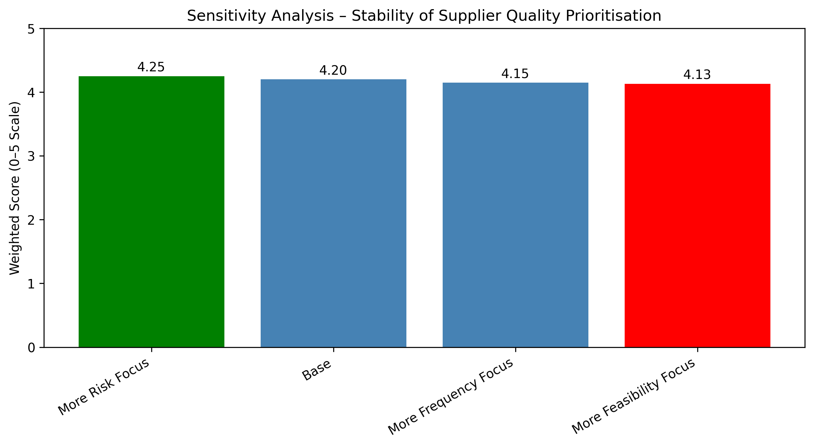
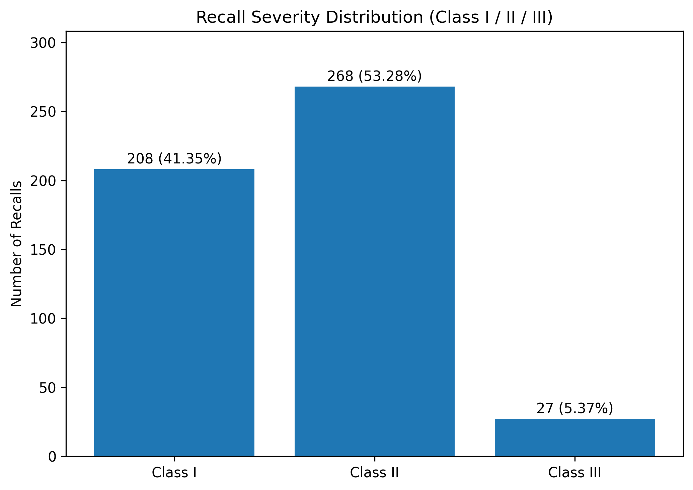

# Prioritising Operational Interventions: A Decision-Analytics Framework for Supplier Quality Risk

## Project Overview

This project demonstrates a structured decision-analytics approach to prioritising operational interventions within regulated environments.

The core question addressed:

> Where should leadership intervene to achieve the maximum reduction in regulatory and operational risk, given limited time and resources?

The analysis identifies **Supplier Quality Monitoring & Qualification** as a high-priority intervention point using public recall data, structured scoring logic, and sensitivity testing.

---

## Business Context

Organisations operating in regulated industries (e.g., food, pharma, medical products) face recurring recall events.

Leadership cannot address all operational risks simultaneously. A structured prioritisation framework is required to:

- Evaluate severity impact
- Assess cost of inaction
- Measure detectability gaps
- Consider issue frequency
- Account for implementation feasibility

This project builds such a framework.

---

## Workflow:
1. Notebook 01 → Clean severity dataset  
2. Notebook 02 → Identify supplier-linked risk evidence  
3. Notebook 03 → Apply decision framework & sensitivity testing  

---

## Data Strategy

The project uses a transparent mix of:

- Public recall severity data (regulatory classifications)
- Keyword-based proxy modelling for supplier linkage
- Structured synthetic feasibility modelling (explicit assumptions documented)

Raw dataset source: Public recall data accessed via Kaggle (FDA-based recall records).

Raw files are not redistributed; processed outputs are included.

---

## Key Findings

### 1. Recall Severity

- 94%+ of recall events are classified as Class I or Class II
- Class I recalls represent severe health risk exposure

### 2. Supplier Linkage Evidence

- ~80% of recall events contain supplier/upstream indicators
- 96% of supplier-linked recalls fall into Class I or Class II categories

This suggests strong upstream risk concentration.

---

## Decision Framework

Criteria and weights:

| Criterion | Weight |
|------------|--------|
| Risk Severity | 30 |
| Cost of Inaction | 25 |
| Detectability | 20 |
| Frequency | 15 |
| Feasibility | 10 |

Final weighted score:

**Supplier Quality Monitoring & Qualification = 4.2 / 5**

This places it in the high-priority intervention category.

---

## Sensitivity Analysis

The recommendation remains stable under multiple weighting scenarios:

- Risk-heavy weighting → 4.25
- Base scenario → 4.20
- Frequency-heavy weighting → 4.15
- Feasibility-heavy weighting → 4.13

The prioritisation remains robust across leadership preference shifts.

---

## Visual Outputs

### Sensitivity Analysis (Robustness Check)

### Recall Severity Distribution

---

## Strategic Conclusion

Supplier Quality Monitoring & Qualification represents an upstream, high-leverage intervention point capable of reducing high-severity regulatory exposure.

The analysis demonstrates:

- Evidence-based risk identification
- Structured prioritisation logic
- Robustness under preference variation
- Transparent modelling assumptions

---

## Key Takeaway

This project illustrates how analytics can be used not merely to describe data, but to support executive-level decision-making and strategic prioritisation.
